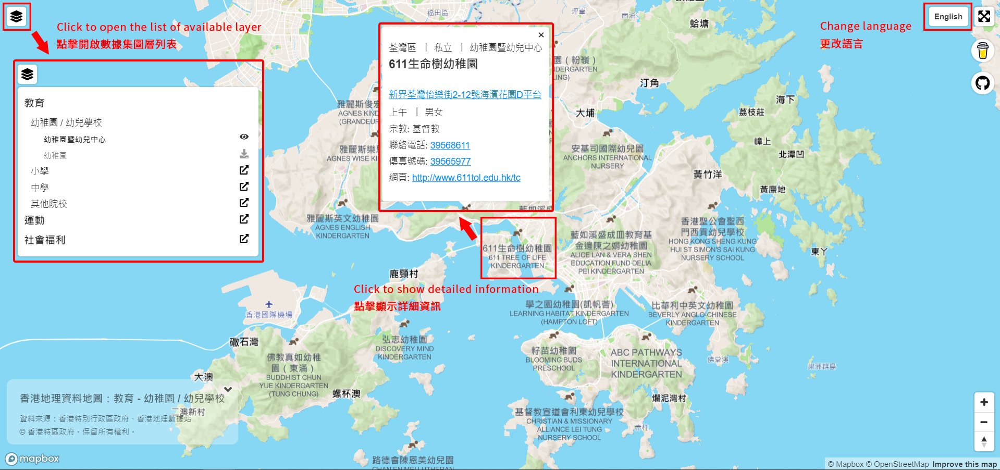

# hk-geodata-maps

> 中文版本請按 [這裡](README-EN.md)。

Getting different categories of geo data from [HONG KONG GEODATA STORE](https://geodata.gov.hk/gs/), and display them using open map [Mapbox](https://www.mapbox.com/).

Current data:
1. Education - Kindergartens, primary and secondary schools
2. Sports - Ball games, water sports and sports centre
3. Social welfare - Services for disabilities, minoriy community, child and elderly

## Demo
[Demo](https://demching.github.io/hk-geodata-maps/)

Tutorial

## Source of data
1. HONG KONG GEODATA STORE
2. The Government of the HKSAR

Please do proper attribution when using those data.

## Your support
If you find this repo useful, please share to your friends. Or you can buy me a coffee:

