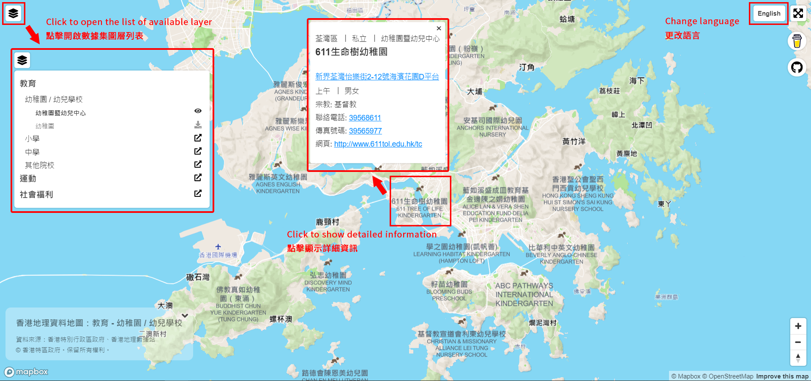

# hk-geodata-maps

> Check [here](README-EN.md) for English version.

從[香港地理數據站](https://geodata.gov.hk/gs/)獲取不同分類的地理數據，並用免費的開源地圖 [Mapbox](https://www.mapbox.com/) 展示。

現有資料：
1. 教育 - 幼稚園、中小學
2. 運動 - 球類活動、水上活動、體育館
3. 社會福利 - 針對殘疾人士、少數族裔、幼童及長者等提供的服務

## Demo
[Demo](https://demching.github.io/hk-geodata-maps/)

教學

## 資料來源
1. 香港地理數據站
2. 香港特別行政區政府

使用相關數據時請注明資料來源及著作權。

## 你的支持
香港嘅開放數據主要係透過[資料一線通](https://data.gov.hk/)提供，入面有超多唔同類型嘅資料比你去睇，有天文地理亦有交通資訊，而家好多有關本地疫情嘅即時地圖其實都係攞緊嗰度嘅資料。

而[香港地理數據站](https://geodata.gov.hk/gs/)嘅資料主要都係同地點有關，資料格式相對統一。

如果覺得呢個repo有用可以分享比其他人，如果想課金支持我可以撳呢條link：

